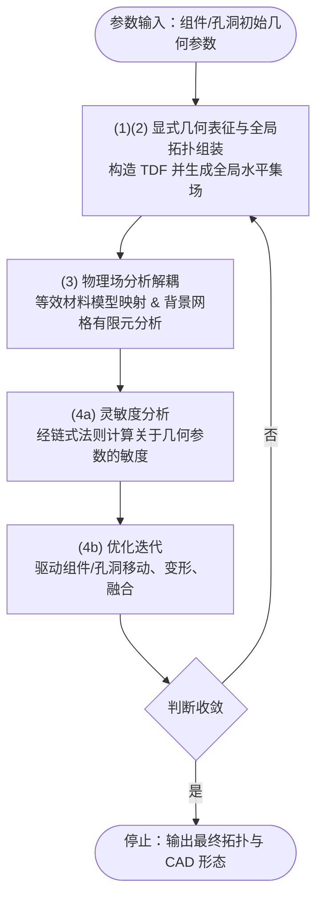

大连理工大学郭旭院士团队（[郭旭院士个人主页](https://faculty.dlut.edu.cn/2000011087/ "null")）长期依托工业装备结构分析国家重点实验室，深耕计算力学、结构优化以及工业级科学计算软件开发。团队打破了传统基于像素/体素（Pixel/Voxel）的隐式拓扑优化范式，主导开发了**显式拓扑优化理论（MMC/MMV）**，并在**工业级软件工程化（SIPESC）** 与 **问题无关机器学习（PIML）** 赋能的超大规模结构优化方面取得了具有国际影响力的突破。

# 研究方向一：显式拓扑优化 (MMC/MMV 框架)

移动变形组件（Moving Morphable Components, MMC）及移动变形孔洞（Moving Morphable Voids, MMV）方法的核心思想是利用一组具备显式几何特征的组件来描述结构的拓扑与形状。

## 核心文献与发展脉络

- **奠基与开山之作（确立显式几何描述与等效材料模型范式）：**
    
	1. _Doing Topology Optimization Explicitly and Geometrically—A New Moving Morphable Components Based Framework_
		> 这篇开山之作颠覆了传统基于网格像素/体素的隐式拓扑优化范式，创新性地提出将宏观结构视为一系列可重叠的 “移动变形组件（MMC）” 的布尔并集。该框架将优化过程转化为对组件显式几何参数（如中心坐标、长宽、倾角）的调控，极大降低了设计变量维度并消除了灰度单元，打通了优化结果与 CAD 系统的无缝衔接；但由于其全局拓扑完全依赖于实体组件的叠加与退化（即纯粹的求并集操作），该经典框架的一个固有局限是**无法在全材料域内部“无中生有”地生成新孔洞**，其拓扑演化必须依赖于初始排布时组件之间预留的间隙。
	
    2. _A new topology optimization approach based on moving morphable components (MMC) and the ersatz material model_
	    > 作为 MMC 框架的第二次重大演进，本文直接针对 2014 年初代框架在“几何拟合度”与“计算效率”上的局限进行了底层重构。与 2014 年相比，其核心区别体现在两个维度：第一，在连续几何层面，打破了初代仅支持等厚度矩形组件的限制，构建了带有厚度轮廓函数 $f(x')$ 的全新拓扑描述函数（TDF），允许组件呈现线性或二次变厚度特征，大幅增强了极少变量下的复杂几何表征能力；第二，在离散求解层面，彻底摒弃了 2014 年计算极为昂贵的扩展有限元法（XFEM），创新性地引入了等效材料模型（Ersatz Material Model）。通过将显式的几何边界经由正则化 Heaviside 函数直接投影到固定背景网格上，彻底解耦了优化模型与分析网格，实现了计算效率的质的飞跃。此外，本作首次开源了 188 行 MATLAB 代码，确立了该框架在学术界的数值实现标准。需要特别强调的是，这篇论文依然没有解决 “生成孔洞” 的核心难题。
    
	3.  _Structural Topology Optimization Through Explicit Boundary Evolution_
		> 本文从根本上突破了传统 MMC 框架无法自主生成拓扑孔洞的理论瓶颈，正式确立了移动变形孔洞（MMV）的数学基础。通过引入显式边界演化机制，将结构描述从实体组件的求并集转换为可移动 “负空间” 孔洞的布尔操作。这种基于连续变量的显式拓扑演化，保持了极高的数学严谨性与连续-离散形式的一致性。
    
- **形态与维度的拓展 (曲线组件与三维空间孔洞演化)：** 
	
	3. _Explicit structural topology optimization based on moving morphable components (MMC) with curved skeletons_ 
		> 本文是 MMC 框架在几何表征自由度上的又一次核心跨越。针对前作（Guo 2014 的等厚直杆与 Zhang 2016 的变厚直杆）中组件骨架必须保持“直线”的拓扑刚性，本作创新性地引入了 “曲线骨架（Curved Skeletons）”。在数学构造上，本文彻底摒弃了前两作依赖的超椭圆（Hyperelliptic）方程底座，转而采用一种基于距离函数与布尔交集（极小值 $\min$ 算子）的全新拓扑描述函数（TDF）构造范式。通过定义局部解析曲线 $f(x')$ 作为中轴骨架，并结合局部厚度函数 $d(x')$，实现了组件 “走向” 与 “截面厚度” 的彻底解耦。这一底层数学突破，使得仅用寥寥数个组件即可精确、光滑地拟合高度非线性的复杂传力路径（如柔顺机构或拱形结构），从根本上消除了用大量短小直杆拼接曲线时产生的边界锯齿与变量维度激增问题，赋予了 MMC 框架极其强大的显式几何建模自由度。**需要特别强调的是，这篇论文依然没有解决 “生成孔洞” 的核心难题，其拓扑变化仍只能被动依赖实体组件间的相互交叠与隐藏。**
	
	4. _Explicit three dimensional topology optimization via Moving Morphable Void (MMV) approach_
    
- **物理约束攻坚与复杂结构应用 (解决局部奇异性与多孔填充)：** 
	
	5. _A moving morphable void (MMV)-based explicit approach for topology optimization considering stress constraints_ 
	
	6. _Optimal design of shell-graded-infill structures by a hybrid MMC-MMV approach_
    
- **权威总结：** 
	7. _A comprehensive review of explicit topology optimization based on moving morphable components (MMC) method_

# 研究方向二：问题无关机器学习 (PIML)

问题无关机器学习（Problem-Independent Machine Learning, PIML）方法的核心思想不是针对某一特定载荷、边界条件或优化目标训练端到端代理模型，而是学习可嵌入有限元分析框架的局部力学算子。其典型实现路径是通过机器学习离线构造粗网格单元或子结构内部的多尺度有限元形函数，从而在在线阶段显著降低大规模结构分析与拓扑优化的计算代价。

## 核心文献与发展脉络

- **前导探索（机器学习与显式拓扑优化框架结合）：**  
  
	1. _Machine learning-driven real-time topology optimization under moving morphable component-based framework_  
  
- **PIML 方法提出（建立问题无关学习范式）：**  
  
	1. _Problem-independent machine learning (PIML)-based topology optimization—a universal approach_  
  
- **大规模结构分析与拓扑优化拓展（子结构与多尺度有限元框架）：**  
  
	1. _A problem-independent machine learning (PIML) enhanced substructure-based approach for large-scale structural analysis and topology optimization of linear elastic structures_  
  
	2. _Problem-independent machine learning-enhanced structural topology optimization of complex design domains based on isoparametric elements_  
  
- **Data-free 模型发展（摆脱预生成训练数据依赖）：**  
  
	1. _A mechanics-based data-free problem independent machine learning (PIML) model for large-scale structural analysis and design optimization_  
  
- **三维结构与显式几何优化应用：**  
  
	1. _Problem-independent machine learning (PIML) enhanced 3D lattice composite structures optimization via moving morphable components approach_  
  
- **高性能并行计算拓展：**  
  
	1. _A high-performance parallel algorithm based on problem independent machine learning (PIML) for large-scale topology optimization_

# 研究方向三：工业软件与高性能计算布局