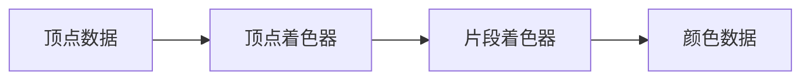

# OpenGL 学习笔记

## 一、OpenGL 简介

## 二、着色器
着色器是运行在 GPU 上的小程序，用于处理图形渲染，
开发者需要编写着色器程序来控制图形的渲染过程。着色器程序是用
GLSL 语言编写的，GLSL 是一种类似 C 语言的语言，专门用于编写着色器程序。
本节将介绍 OpenGL 着色器的基本概念和使用方法。

一个完整的着色器程序至少包含一个顶点着色器和一个片段着色器。
OpenGL 渲染的流程是: 顶点数据传给顶点着色器，顶点着色器处理顶点数据， 
然后将处理后的数据传给片段着色器，片段着色器处理片段数据，最后输出颜色数据。
<div style="text-align: center;">


</div>

### （1）顶点着色器


下面是一个简单的顶点着色器程序：
```glsl
#version 460 core
layout (location = 0) in vec3 aPos;
layout (location = 1) in vec2 aTexCoords;
uniform mat4 transform; //变换矩阵

out vec2 TexCoords;

void main()
{
    TexCoords = aTexCoords;
}
```
在这个顶点着色器程序中，我们定义了一个输入变量 aPos 和一个输入变量 aTexCoords，
一个全局变量 transform，即两种数据,
输入的数据和全局的数据。下面介绍如何传递这两种数据。
- 输入数据：aPos 和 aTexCoords 这两个是在定义顶点数据的时候就要定义好的:
  比如在定义一个三角形的时候，我们需要定义三个顶点，每个顶点都有一个位置坐标和一个纹理坐标。
  如下所示：
  ```python
  glBindVertexArray(self.vao)

  glEnableVertexAttribArray(0)
  glVertexAttribPointer(0, 3, GL_FLOAT, GL_FALSE, 6 * node.itemsize, c_void_p(0))

  glEnableVertexAttribArray(1)
  glVertexAttribPointer(1, 2, GL_FLOAT, GL_FALSE, 6 * node.itemsize, c_void_p(3 * self.node.itemsize))
  ```
  我们定义了两个顶点属性，一个是位置属性，一个是纹理坐标属性, 这些数据存在 `vao` 中。
  然后由 `glVertexAttribPointer` 函数将这些数据传递给顶点着色器程序。

  **`glVertexAttribPointer` 函数的用法:**
  1. 第一个参数是属性的位置，如顶点的位置 `aPos` 是 0，纹理坐标 `aTexCoords` 是 1，
  2. 第二个参数是属性的大小，如 `aPos` 是 3（3个数），纹理坐标 `aTexCorrds` 是 2（2个数），
  3. 第三个参数是属性的类型，
  4. 第四个参数是是否标准化，
  5. 第五个参数是步长（即每个数的比特大小），
  6. 第六个参数是偏移量, 即从哪里开始读取数据。

- 全局数据
    设置全局数据的方法是使用 `glUniform` 函数，如下所示：
    ```python
    glUseProgram(shader_program)
    transform = glm.scale(transform, glm.vec3(0.5, 0.5, 0.5))
    glUniformMatrix4fv(glGetUniformLocation(shader.program, "transform"), 1, GL_FALSE, glm.value_ptr(transform))
    ```
    其中 `glGetUniformLocation` 函数用于获取全局变量的位置，`glUniformMatrix4fv` 函数用于传递数据。
    如果是 `int` 类型的数据，使用 `glUniform1i` 函数; `float` 类型的数据，使用 `glUniform1f` 函数。
    其他类型的数据类似。

    **注意：** 在传递数据之前，需要先调用 `glUseProgram` 函数激活着色器程序!

### （2）片段着色器
下面是一个简单的片段着色器程序：
```glsl
#version 460 core
in vec2 TexCoords;

uniform int mode;  // 0: 显示面 1: 显示边 2: 显示面和边 3: 如果有纹理数据显示纹理
uniform vec4 faceColor;
uniform vec4 edgeColor;
uniform sampler2D textureSampler0;
out vec4 FragColor;

void main()
{
    if (mode == 0) {
        FragColor = faceColor;  // 只显示面
    } else if (mode == 1) {
        FragColor = edgeColor;  // 只显示边
    } else if (mode == 2) {
        FragColor = faceColor;  // 同时显示面和边
    } else if (mode == 3) {
        FragColor = texture(textureSampler0, TexCoords); // 使用纹理
    }
}
```
在这个片段着色器程序中，我们定义了一个输入变量 TexCoords 和四个全局变量
mode、faceColor、edgeColor 和 textureSampler0。
其输入数据是由顶点着色器传递过来的，所以顶点着色器中的输出变量需要和片段着色器中的输入变量一一对应。
全局数据的定义和传递方法和顶点着色器类似，特别的一个是纹理数据 textureSampler0，
其传递方法如下：
```python
glUseProgram(shader_program)
glActiveTexture(GL_TEXTURE0)
glBindTexture(GL_TEXTURE_2D, texture)
glUniform1i(glGetUniformLocation(shader_program, "textureSampler0"), 0)
```
其中 `glActiveTexture` 函数用于激活纹理单元，`glBindTexture` 函数用于绑定纹理数据，
`glUniform1i` 函数用于传递纹理数据。testure 是纹理数据的 ID, 这里假设已经加载了纹理数据。

需要注意的是，当有多个纹理数据时，需要使用不同的纹理单元，如下所示：
```python
glActiveTexture(GL_TEXTURE0)
glBindTexture(GL_TEXTURE_2D, texture0)
glUniform1i(glGetUniformLocation(shader_program, "textureSampler0"), 0)

glActiveTexture(GL_TEXTURE1)
glBindTexture(GL_TEXTURE_2D, texture1)
glUniform1i(glGetUniformLocation(shader_program, "textureSampler1"), 1)
```
这里使用了两个纹理单元，分别是 GL_TEXTURE0 和 GL_TEXTURE1。注意：
1. 纹理单元的数量是有限的
2. `glUniform1i` 函数的第二个参数是 **纹理单元** 的索引，从 0 开始。


