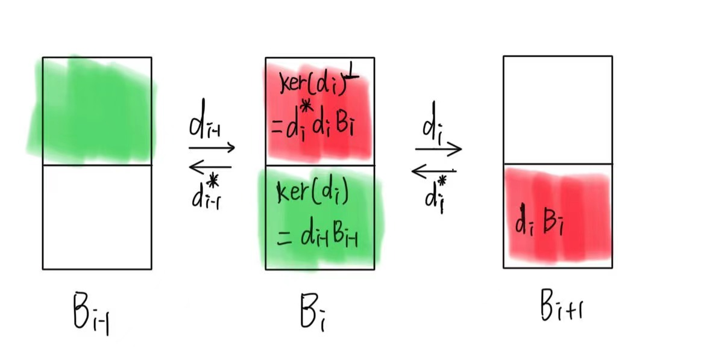
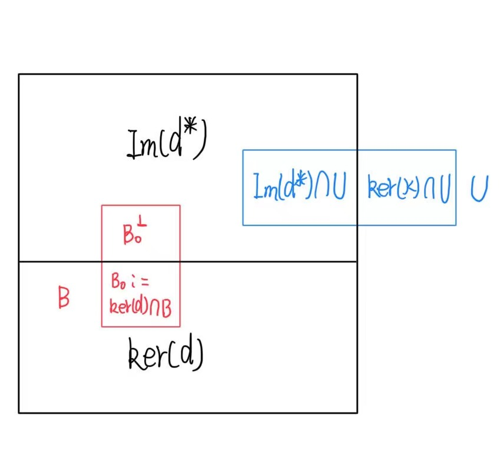

# $H(\mathrm{divdiv})$ 协调的有限元
- 有限元三元组：$(K, V, \mathrm{Dof})$, 其中 $\mathrm{Dof}$ 是 $V$ 的对偶空间 $V'$
的一组基。

- **构造有限元的重点就是找到一组合适的$\mathrm{Dof}$, 对函数在边界上
施加连续性以至于整体函数属于 $H(\mathrm{d}, \Omega)$**

- 对于一个微分算子 $\mathrm{d}$, 定义对应的迹算子 $\mathrm{tr^d}$, bubble 函数空间
$\mathbb{B}(\mathrm{d}) = \mathrm{ker(tr^d)}\cap V$. 那么 
  $$
  V = \mathbb{B}(\mathrm{d})\oplus\mathcal{E}(\mathrm{img(tr^d)})
  $$
  其中 $\mathcal{E} : \mathrm{img(tr^d)} \to V$ 是一个单射扩展算子，满足:
  $$
  \mathcal{E}\circ \mathrm{tr^d} = \mathrm{id}_{\mathrm{img(\mathcal{E})}}
  $$
- $V' = \mathbb{B}'(\mathrm{d})\oplus (\mathrm{img(tr^d)})'$*(第二项需要进行扩展)*.
- 将 $\mathbb{B}(\mathrm{d})$ 分成两部分 : $E_0 = \mathbb{B}(\mathrm{d})\cap \mathrm{ker(d)},\ E_0^{\perp} = \mathbb{B}(\mathrm{d})\backslash E_0$.
- $\mathbb{B}'(\mathrm{d})=E_0'\oplus(E_0^{\perp})'$
- 使用格林公式（高斯公式，斯托克斯公式）可以得到 $(\mathrm{img(tr^d)})'$
    的基。
- $(E_0^{\perp})'$ 的基为 $\{(\mathrm{d}\cdot, p), p\in \mathrm{d}\mathbb{B}(d)=\mathrm{d}E_0^{\perp}\}$
- $E_0'$ 的基有两种方法得到:
  1. 直接法：$E_0$ 是迹零复形中上一个空间的像空间。
  2. 对偶法：$E_0'$ 与 Koszul 算子的零空间同构。

- 若 $\{\mathbb{B}_i\}_{i=0}^{n-1}$ 是一系列有限维 Hilbert
    空间，在 $L^2$ 内积下组成了一个恰当的 Hilbert 复形。
    $$
    0\xrightarrow{\subset}\mathbb{B}_0\xrightarrow{\mathrm{d}_0}
    \cdots \mathbb{B}_i\xrightarrow{\mathrm{d}_i}
    \cdots \mathbb{B}_{n-1}\xrightarrow{} 0
    $$
  若 $\mathbb{B}_i$ 是 $\mathrm{ker}(\mathrm{tr^{d_i}})$ 的子集，那么
  $\mathbb{B}_i = \mathrm{d}^*_i \mathrm{d}_i \mathbb{B}_i\oplus
     \mathrm{d}_{i-1}\mathbb{B}_{i-1}$.

  **证明**: 首先根据复形的恰当性我们有: $\mathrm{d}_{i-1}\mathbb{B}_{i-1} =
  \mathrm{ker}(\mathrm{d}_i)\cap \mathbb{B}_i$.
  首先证明直和性质，若$\mathrm{d}_iv = 0$ 且存在 $q, \mathrm{d}_i^*\mathrm{d}_iq = v$, 那么:
  $$
  (v, v) = (v, \mathrm{d}_i^*\mathrm{d}_iq) = 
           (\mathrm{d}_iv, \mathrm{d}_iq) = 0
  $$
  所以 $v = 0$ 直和性得证。然后证明维数相等，首先我们有
  $\mathrm{dim}(\mathbb{B}_i) = \mathrm{dim}(\mathrm{ker(\mathrm{d_i})}\cap
  \mathbb{B}_i) + \mathrm{dim}(\mathrm{d}_i\mathbb{B}_i)$, 所以只需证明
  $\mathrm{d}^*_i$ 在 $\mathrm{d}_i\mathbb{B}_i$ 上是单射即可: 
  若 $\mathrm{d}_i^*\mathrm{d}_iv = 0$, 那么 
  $$
  (\mathrm{d}_i^*\mathrm{d}_iv, q) = 0\quad\forall q \in \mathbb{B}_i,
  $$
  所以
  $$
  (\mathrm{d}_iv, \mathrm{d}_i q) = 0\quad\forall q \in \mathbb{B}_i,
  $$
  所以 $\mathrm{d}_i v = 0$，所以 $\mathrm{d}^*_i$ 在 $\mathrm{d}_i\mathbb{B}_i$
  上是单射.
  

    
  

- 根据上面的分解可以给出 $\mathbb{B}_i'$ 的一组基:
  $$
  \begin{aligned}
    (v, \mathrm{d}^*_i q), & \quad \quad \forall q \in \mathrm{d}_i \mathbb{B}_i\\
    (v, q), & \quad \quad \forall q\in \mathrm{d}_{i-1}\mathbb{B}_{i-1}
  \end{aligned}
  $$
- $U, V$ 是两个 Hilbert 空间，$\mathcal{A} : U \to V$，是两个空间之间的线性算子，
  那么有:
  $$
  \mathrm{ker}(\mathcal{A}) \perp \mathrm{Im}(\mathcal{A}^*)
  $$
  其中 $\mathcal{A}^*$ 是 $\mathcal{A}$ 的共轭算子. 

  **例子:** 对于矩阵 $A$,其对应的算子的共轭算子的矩阵表示为 $A^T$, 所以:
  $$
  \mathrm{ker}(A) \perp \mathrm{Im}(A^T)
  $$
  

    
  

# divdiv 元基函数构造
## 标架定义：
定义边 $e$ 的切向为 $\boldsymbol{t}_e$, 周围两个面为 $F_0, F_1$,
那么，他们的法向量为 $\boldsymbol{n}_{F_0}, \boldsymbol{n}_{F_1}$, 令 
$\boldsymbol{n}_{F_i, e}$ 表示 $e$ 在 $F_i$ 上的外法向量。那么：
$$
\mathrm{sym}(\boldsymbol{n}_{F_0}^T \boldsymbol{t}_e), \quad
\mathrm{sym}(\boldsymbol{n}_{F_1}^T \boldsymbol{t}_e), \quad
\boldsymbol{t}_e^T \boldsymbol{t}_{e}, \quad
\mathrm{sym}(\boldsymbol{n}_{F_0, e}^T \boldsymbol{n}_{F_0} - 
\boldsymbol{n}_{F_1, e}^T \boldsymbol{n}_{F_1})
$$
$$
\boldsymbol{n}_{F_0}^T \boldsymbol{n}_{F_0} + \boldsymbol{n}_{F_1}^T
\boldsymbol{n}_{F_1} - (\boldsymbol{n}_{F_0}\cdot\boldsymbol{n}_{F_1})
\boldsymbol{n}_{F_0}^T \boldsymbol{n}_{F_1}, \quad
\mathrm{sym}(\boldsymbol{n}_{F_0, e}^T \boldsymbol{n}_{F_0} + 
\boldsymbol{n}_{F_1, e}^T \boldsymbol{n}_{F_1})
$$
是对称矩阵空间 $\mathbb{S}$ 的一组基，其中 前 5 个与第 6 个基函数正交，
将 6 个基函数分别记为 $\boldsymbol{b}^e_i, i = 1, \cdots, 6$.

## divdiv 元的迹
定义 divdiv 元的迹算子 $\mathrm{tr}^e, \mathrm{tr}^{F,0}, \mathrm{tr}^{F, 1}$:
$$
\begin{aligned}
  \mathrm{tr}^e(\boldsymbol{\sigma})|_e & := \sum_{F \in \partial T, e \in \partial F} 
  \boldsymbol{n}_{\partial T}\boldsymbol{\sigma n}_{F, e}\\
  \mathrm{tr}^{F, 0}(\boldsymbol{\sigma})|_F & :=
  \boldsymbol{n}_F\cdot\boldsymbol{\sigma n}_F\\
  \mathrm{tr}^{F, 1}(\boldsymbol{\sigma})|_F & :=
  \mathrm{div}(\boldsymbol{\sigma n_F}) + \mathrm{div}_F(\boldsymbol{\sigma n}_F)
\end{aligned}
$$

## divdiv 元的基函数
假设 $\boldsymbol{\sigma} = \sigma\otimes\boldsymbol{S}$, 其中 $\sigma \in \mathbb{P}_k(T)$, $\boldsymbol{S} \in \mathbb{S}_2^d$, 是一个对称矩阵。
首先考察 $\mathrm{tr}^e$ 的核空间，
假设 $e$ 周围的面为 $F_0, F_1$, 那么：
$$
\mathrm{tr}^e(\boldsymbol{\sigma})|_e = \boldsymbol{n}_{F_0}\boldsymbol{\sigma
n}_{F_0, e} + \boldsymbol{n}_{F_1}\boldsymbol{\sigma n}_{F_1, e} 
= \sigma (\boldsymbol{n}_{F_0}\boldsymbol{S}\boldsymbol{n}_{F_0, e} +
\boldsymbol{n}_{F_1}\boldsymbol{S}\boldsymbol{n}_{F_1, e})
$$
所以 
$$
\mathrm{ker}(\mathrm{tr}^e) = \{\sigma\in \mathbb{P}_k(T), \sigma|_e = 0\}
\otimes \mathbb{S}_2^d \oplus \mathbb{P}_k(e)\otimes \{\boldsymbol{S}\in
\mathbb{S}_2^d, \boldsymbol{S}\boldsymbol{n}_{F_0, e} =
-\boldsymbol{S}\boldsymbol{n}_{F_1, e}\}
$$

对于 $\mathrm{tr}^{F, 0}$:
$$
\mathrm{tr}^{F, 0}(\boldsymbol{\sigma})|_F =
\boldsymbol{n}_F\cdot\boldsymbol{\sigma n}_F
= \sigma \boldsymbol{n}_F \boldsymbol{S}\boldsymbol{n}_F
$$
所以
$$
\mathrm{ker}(\mathrm{tr}^{F, 0}) = \{\sigma\in \mathbb{P}_k(T), \sigma|_F = 0\}
\otimes \mathbb{S}_2^d \oplus \mathbb{P}_k(F)\otimes \{\boldsymbol{S}\in
\mathbb{S}_2^d, \boldsymbol{n}_{F}^T\boldsymbol{S}\boldsymbol{n}_F = 0\}
$$
对于 $\mathrm{tr}^{F, 1}$，注意：
$$
\begin{aligned}
\mathrm{div}_F(\boldsymbol{\sigma}) & = tr(\nabla_F \boldsymbol{\sigma})\\
& = tr(\partial_{\boldsymbol{t}_{F, 0}}\boldsymbol{\sigma} +
\partial_{\boldsymbol{t}_{F, 1}}\boldsymbol{\sigma})\\
& = tr(\partial_{\boldsymbol{t}_{F, 0}}\boldsymbol{\sigma}_{ij}
\boldsymbol{t}_{F, 0} \otimes \boldsymbol{e}_i \otimes \boldsymbol{e}_j +
\partial_{\boldsymbol{t}_{F, 1}}\boldsymbol{\sigma}_{ij}
\boldsymbol{t}_{F, 1} \otimes \boldsymbol{e}_i \otimes \boldsymbol{e}_j)\\
& = \partial_{\boldsymbol{t}_{F, 0}}\sigma S_{ij}(t_{F, 0})_{i} \boldsymbol{e}_j
+ \partial_{\boldsymbol{t}_{F, 1}}\sigma S_{ij}(t_{F, 1})_{i} \boldsymbol{e}_j\\
& = \partial_{\boldsymbol{t}_{F, 0}} \sigma\boldsymbol{S}\boldsymbol{t}_{F, 0} +
\partial_{\boldsymbol{t}_{F, 1}} \sigma\boldsymbol{S}\boldsymbol{t}_{F, 1}
\end{aligned}
$$
进一步的，我们有：
$$
\begin{aligned}
\mathrm{div}(\boldsymbol{\sigma}) = tr(\nabla\boldsymbol{\sigma}) 
= \partial_{\boldsymbol{t}_{F, 0}}\sigma \boldsymbol{S}\boldsymbol{t}_{F, 0} +
\partial_{\boldsymbol{t}_{F, 1}}\sigma \boldsymbol{S}\boldsymbol{t}_{F, 1}
+ \partial_{\boldsymbol{n}_{F}}\sigma \boldsymbol{S}\boldsymbol{n}_{F}
\end{aligned}
$$
这个迹的核空间最为复杂，可以分为三个分量都是 0 的情况，以及分量不全为 0 的情况。
可以证明：$\mathrm{ker}(\mathrm{div}_F)$  可以分解为几个空间的直和：
- $\{\sigma = 0\}\otimes \mathbb{S}$
- $\mathbb{P}_k(F)\otimes\{\boldsymbol{n}_F\otimes \boldsymbol{n}_F, 
  \boldsymbol{t}_{F_0}\otimes 
  \boldsymbol{t}_{F_0}, \boldsymbol{t}_{F_1}\otimes \boldsymbol{t}_{F_1},
  \mathrm{sym}(\boldsymbol{t}_{F_0}\otimes \boldsymbol{t}_{F_1})\}$
- $\mathrm{sym}(\mathrm{rot}_F(\mathbb{P}_{k+1}(F))\otimes \boldsymbol{n}_F)$

第一类的个数为 $k(k+1)(k+2)$，第二类的个数为 $2(k+1)(k+2)$，第三类的个数为 $(k+2)(k+3)/2-1$, 总共为 $(k+1)(k+2)(k+3) - k(k+1)/2$, 与 $\mathrm{ker}(\mathrm{div}_F)$ 的维数相等。

对于三角形 $T$ 上的 divdiv 元，
定义：
$$
\begin{aligned}
w_{0} = a_0\lambda_1 t_2 - b_0\lambda_2 t_1, \\
w_{1} = a_1\lambda_2 t_0 - b_1\lambda_0 t_2, \\
w_{2} = a_2\lambda_0 t_1 - b_2\lambda_1 t_0, \\
\end{aligned}
$$
即 
$$
w_i = a_i\lambda_{i+1}t_{i+2} - b_i\lambda_{i+2}t_{i+1}. 
$$
令 $T_{ij} = t_i\cdot t_j$, $N_{ij} = t_i\cdot n_j$, 那么：
$$
w_i\cdot t_j = a_iT_{i+2, j} \lambda_{i+1} - b_iT_{i+1, j}\lambda_{i+2}
$$
$$
w_i\cdot n_j = a_iN_{i+2, j} \lambda_{i+1} - b_iN_{i+1, j}\lambda_{i+2}
$$
令 $\boldsymbol{f} = f (w_0\otimes w_{1} + w_1\otimes w_{0})$，那么：
$$
\begin{aligned}
div_{e_0}(\boldsymbol{f}\cdot \boldsymbol{n}_0)|_{e_0} & =
div_{e_0}(f(w_0\otimes w_{1} + w_1\otimes w_{0})\cdot \boldsymbol{n}_0)\\
& = div_{e_0}(f(a_0N_{20}\lambda_1 -
b_0N_{10}\lambda_2)w_1)\\
& = fdiv_{e_0}( (a_0N_{20}\lambda_1 -
b_0N_{10}\lambda_2)w_1)\\
& \quad + \partial_{t_0}f (
(a_0N_{20}\lambda_1 - b_0N_{10}\lambda_2)w_1)\cdot t_0\\
& = fdiv_{e_0}( (a_0N_{20}\lambda_1 - b_0N_{10}\lambda_2)w_1)\\
& \quad + \partial_{t_0}f (a_0N_{20}\lambda_1 - b_0N_{10}\lambda_2)
a_1\lambda_1
\end{aligned}
$$

 
 
 
 
 
 
 
 
 
 
 
 
 
