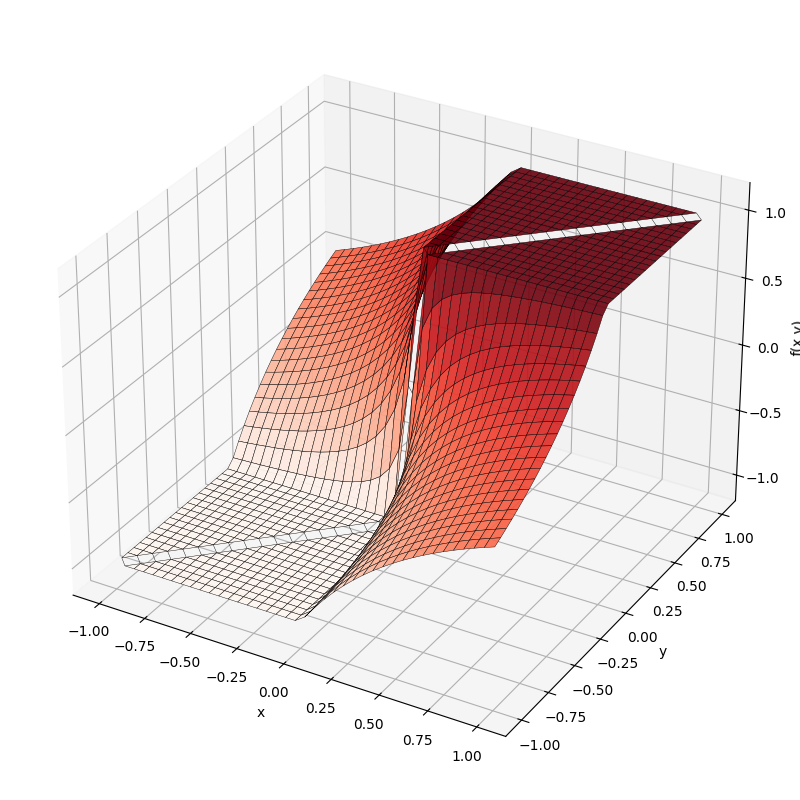
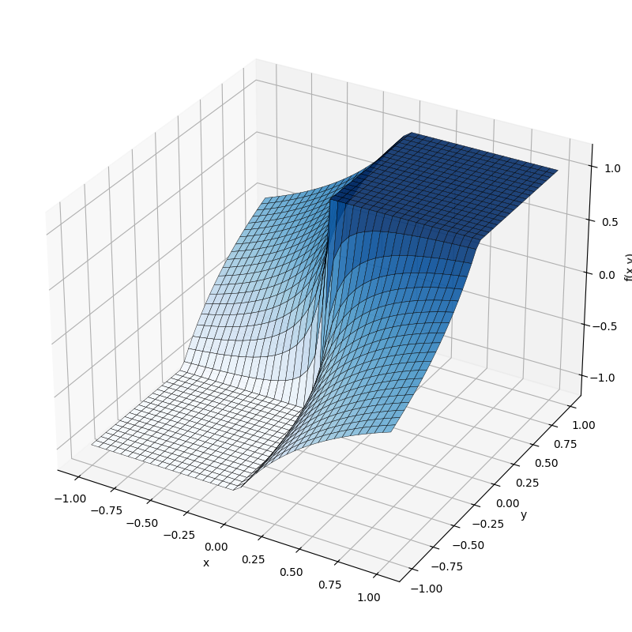

<!-- _class: cover -->
<!-- _paginate: skip -->

数据科学与大数据方向核心课程试讲：《数值分析》

# 误差的基本概念

  

    试讲人：何亮
    湘潭大学 · 数学与计算科学学院
    2026 年 4 月 17 日
  

---

<!-- _class: objectives -->

## 本节学习目标

- 理解数值计算误差的**来源与类型**
- 掌握**绝对误差**、**相对误差**与**有效数字**的定义与计算
- 理解误差在四则运算中的**传播规律**
- 识别数值计算中常见的**不稳定**情形，并了解基本规避思路

---

<!-- _class: objectives -->
<!-- _paginate: hold -->

## 本节学习目标

- 理解数值计算误差的**来源与类型**
- 掌握**绝对误差**、**相对误差**与**有效数字**的定义与计算
- 理解误差在四则运算中的**传播规律**
- 识别数值计算中常见的**不稳定**情形，并了解基本规避思路

> **思考** 
为什么一个在纸面上看似正确的公式，到了计算机中实现时，却可能出现精度丢失，甚至得到 NaN 这样的异常结果？

---

## 一、误差的来源与类型

  实际问题
  
    模型误差
    →
    观测误差
  
  数学模型
  
    截断误差
    →
    &nbsp;
  
  数值方法
  
    舍入误差
    →
    传播误差
  
  计算结果

---

<!-- _paginate: hold -->

## 一、误差的来源与类型

  实际问题
  
    模型误差
    →
    观测误差
  
  数学模型
  
    截断误差
    →
    &nbsp;
  
  数值方法
  
    舍入误差
    →
    传播误差
  
  计算结果

| 误差类型 | 来源 |
|:------:|:---:|
| 模型误差 | 数学建模时的简化假设 |
| 观测误差 | 测量仪器精度限制 |
| **截断误差** | 无穷级数取有限项 |
| **舍入误差** | 浮点数有限位表示 |
| **传播误差** | 已有误差随运算过程积累 |

---

## 数值计算中重点关注的三类误差

在五类误差中，模型误差和观测误差更多来自客观现实；在数值计算中，通常更关注下面三类误差：

1. **截断误差 (数学层面)**
用有限过程逼近无限过程时产生的误差。例如：Taylor 展开取有限项、连续问题离散化。

2. **舍入误差 (硬件层面)**
计算机只能进行有限精度表示与运算，因此实数进入机器后会产生舍入误差。

3. **传播误差 (算法层面)**
已有误差会在后续运算中继续传递，并可能累积或放大。当出现相近数相减、近零数作除数时，这种现象尤其明显。

因此，数值分析不仅研究“如何近似”，也研究“如何稳定地近似”。

---

## 二、近似数的误差和有效数字

<h3 style="margin-bottom:0.1em;">绝对误差</h3>

$$E(x) = x - x^*$$

若 $|x - x^*| \leq \eta$，则称 $\eta$ 为近似数 $x^*$ 与准确数 $x$ 的**绝对误差限**。

<!-- **含义：** 绝对误差反映近似值与准确值相差多少。 -->

**思考**：绝对误差相同，是否意味着近似程度也相同？

<h3 style="margin-bottom:0.1em;">相对误差</h3>

$$E_r(x) = \frac{x - x^*}{x} = \frac{E(x)}{x},\quad x\neq0$$

若存在正数 $\delta$，使得 $|E_r(x)| \leq \delta$，则称 $\delta$ 为近似数 $x^*$ 与准确数 $x$ 的**相对误差限**。

<!-- **含义：** 相对误差反映误差相对于准确值的大小。 -->

---

## 有效数字

设精确值 $x$ 的近似值为

$$x^* = \pm 0.a_1 a_2 \cdots a_n \times 10^m$$

其中 $a_i(i=1,2,\cdots,n)$ 是 0 到 9 中的某一整数，并且 $a_1\neq 0$。

- 若 $|x - x^*| \leq \frac{1}{2} \times 10^{m-k}$，则称 $x^*$ 具有 $k$ 位**有效数字**。

- 若 $x^{*}$ 的每一位都是有效数字，那么 $x^{*}$ 称为具有 $n$ 位有效数字的**有效数**。

**例：** 用舍入法取 $e = 2.7182818\cdots$ 的近似数 $2.7183$

$$|e - 2.7183| = 0.0000181\cdots \leq 0.5 \times 10^{-4}$$

所以 $2.7183$ 有 **5 位有效数字**。

---

## 三、初始误差在运算中的传播

设 $y = f(x_1, x_2, \ldots, x_n)$，当各输入量存在微小误差时，由 Taylor 一阶展开可得：

$$E(y) \approx \sum_{i=1}^{n} \frac{\partial f}{\partial x_i} E(x_i)$$

$$E_r(y) \approx \sum_{i=1}^{n} \frac{\partial f}{\partial x_i} \cdot \frac{x_i}{f} \cdot E_r(x_i),\quad f(x_1, x_2, \ldots, x_n)\neq0$$

**公式告诉我们什么？**

- 绝对误差是一阶近似下各输入误差**加权累积**的结果
- 相对误差不仅与输入误差有关，还与**函数形式**有关
- 当结果接近 0 或出现**相近数相减**时，相对误差可能显著放大

---

<!-- _class: two-col -->

## 加减法的误差传播

当两个相近数作减法时，计算结果的精度可能显著下降。

### ❌ 直接计算（不稳定）

用四位浮点数计算：

$$1 - \cos 2° \approx 1 - 0.9994 = 0.0006$$

**仅有 1 位有效数字！**

> **问题根源**：
相近数相减会造成有效数字严重丢失。

### ✅ 等价变换（稳定）

利用恒等式 $1 - \cos x = 2\sin^2\!\frac{x}{2}$：

$$1 - \cos 2° \approx 0.6092 \times 10^{-3}$$

**恢复 4 位有效数字！**

> **原则：**
通过等价变换避免相近数相减。

---

<!-- _class: two-col -->

## 乘除法的误差传播

在除法运算中，若分母很小，输入中的微小误差可能被显著放大。

### ❌ 直接计算（不稳定）

用四位浮点数计算：

$$\frac{\sin 1°}{1 - \cos 1°} \approx \frac{0.01745}{1 - 0.9998} = \frac{0.01745}{0.0002} = 87.25$$

**结果偏差很大！**

> **问题根源：**
分母很小，且由两个相近数相减得到，误差在除法中被进一步放大。

### ✅ 等价变换（稳定）

利用恒等式 $\dfrac{\sin x}{1 - \cos x} = \dfrac{1 + \cos x}{\sin x},$

$$\frac{\sin 1°}{1 - \cos 1°} \approx \frac{1 + 0.9998}{0.01745} = \frac{1.9998}{0.01745} \approx 114.6$$

**结果更接近真实值！**

> **原则：**
通过等价变换，避免使用过小且不稳定的分母。

---

<!-- _class: two-col -->

## 四、浮点运算与机器数的局限性

计算机的存储空间是有限的，底层数据由**规格化浮点机器数**表示，记为集合 $\mathbb{F}$。
当 $x, y \in \mathbb{F}$ 时，它们的精确实数运算结果 $x \pm y,\ x \times y,\ x / y$ **未必仍属于** $\mathbb{F}$，因此计算机必须对结果进行舍入，返回一个新的机器数。

**例如**：执行加法 $x + y$ 时，先将小阶数向大阶数对齐：

$$x + y = 0.003127 \times 10^{-4} + 0.4153 \times 10^{-4}$$

$$= 0.418427 \times 10^{-4}$$

尾数膨胀到 6 位，超出机器容量，必须截断舍入为 $0.4184 \times 10^{-4}$，故 $x + y \notin \mathbb{F}$。

> **核心数学事实**：机器数集合 $\mathbb{F}$ 对四则运算一般不封闭，因此计算机运算通常伴随着舍入。

---

## 五、数值案例

**考察函数：**

$$f(x, y) = \frac{|x| - |y|}{x - y}$$

接下来，我们通过下面三个问题来分析这个函数：

- 当 $x$ 与 $y$ 很接近时，若直接用**有限精度浮点运算**计算，会出现什么问题？

- 能否通过**等价变换**改写这个函数，从而避免不稳定的减法结构？

- 两个在数学上恒等的公式，在**计算机有限精度运算**下，结果会有什么差别？

---

## 原始函数的不稳定性分析

**原始函数：** $f(x, y) = \dfrac{|x| - |y|}{x - y}$

基于多元函数误差传播公式，可将其相对误差写为

$$\footnotesize  E_r(f) = \left[\frac{\text{sign}(x)}{|x|-|y|} - \frac{1}{x-y}\right]xE_r(x) + \left[\frac{-\text{sign}(y)}{|x|-|y|} + \frac{1}{x-y}\right]yE_r(y)$$

下面主要考虑 $x \approx y > 0$ 的情形，将分母 $x-y$ 代入误差传播公式，可得

$$\small E_r(x-y) \approx \frac{x}{x-y}E_r(x) - \frac{y}{x-y}E_r(y),\quad \left|\frac{x}{x-y}\right|, \left|\frac{y}{x-y}\right|\to\infty$$

> **结论**： 原始函数同时包含“相近数相减”和“分母过小”，直接计算容易产生严重的误差放大。

---

## 重构函数：化减法为加法

对原函数分子分母同乘 $(|x| + |y|)$，并约去公因子 $(x - y)$，可得重构函数 $g(x,y)=\dfrac{x+y}{|x|+|y|}$

基于多元函数误差传播公式，可将其相对误差写为

$$\footnotesize E_r(g) = \left[\frac{-\text{sign}(x)}{(|x| + |y|)} + \frac{1}{(x + y)}\right]xE_r(x) + \left[\frac{-\text{sign}(y)}{(|x| + |y|)} + \frac{1}{(x + y)}\right]yE_r(y)$$

减法被成功转化为同号相加。当 $x \approx y > 0$ 时，对分母 $x+y$ 有

$$\small E_r(x+y) \approx \frac{x}{x+y}E_r(x) + \frac{y}{x+y}E_r(y)\quad \frac{x}{x+y}, \frac{y}{x+y}\approx0.5$$

> **结论**： 等价变换将减法改写为加法，使误差系数保持有界，计算显著更稳定。

---

## 可视化验证：数学上的等价 ≠ 计算机底层的等价

⚠️ $f(x,y)$：在 $x \approx y$ 附近易出现数值震荡，甚至产生 NaN。

✅ $g(x,y)$：化减为加，显著改善计算稳定性。

> **注意**：在具体的数值实现中，为避免 $|x|+|y|$ 过小或为 0，通常在分母中加入极小常数 $\epsilon$ 作为数值保护。

---

<!-- _class: cover -->
<!-- _paginate: skip -->

数据科学与大数据方向核心课程试讲：《数值分析》

# 感谢聆听

试讲到此结束，欢迎各位老师批评指正

